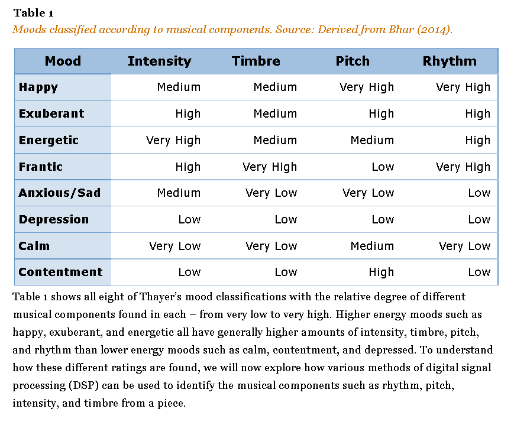

# Howdy Hack 2021:

### Team Members:

Kaleb Dickerson, Phu Jack Nguyen, Anh Nguyen, Anh Hoang.

### Summary

Use python and OpenCV to detect user's mood using facial recognition and play corresponding song on spotify.

Angry -> Rap

Disgust -> Punk/Emo

Fear -> Classical

Happy -> Pop

Neutral -> Jazz

Sad -> Country

Surprise -> Rick Roll

(from https://sites.tufts.edu/eeseniordesignhandbook/2015/music-mood-classification/)

(used material UI npm install @material-ui/core)
